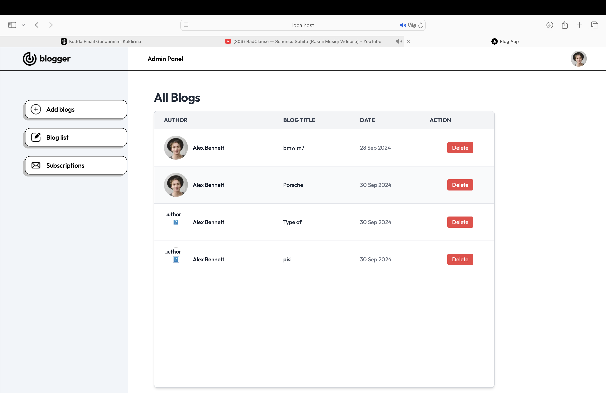
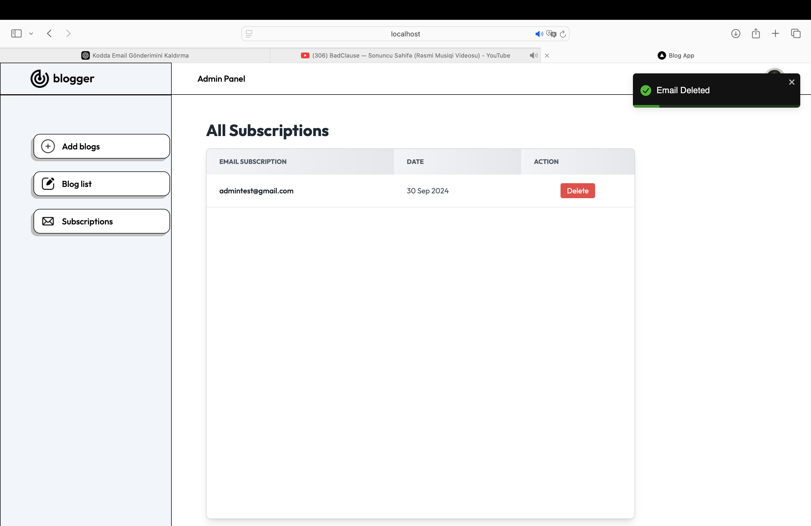
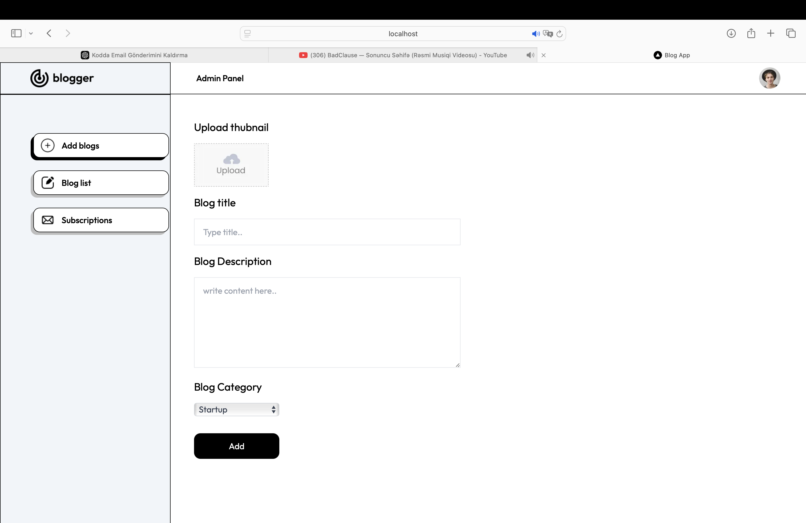
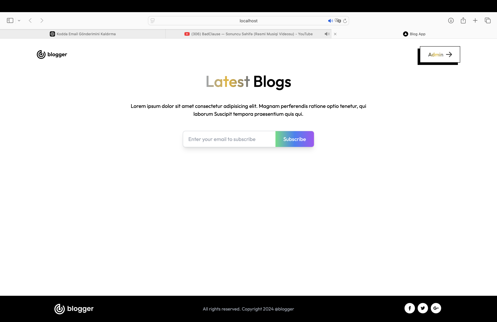
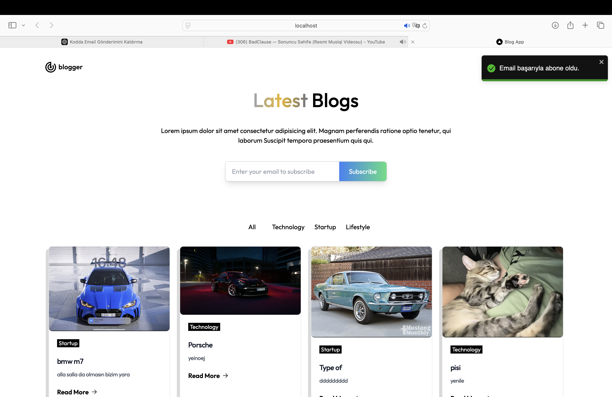

# Blogger Admin Panel & User Subscription

This project is a blogging platform where an admin can create, edit, and delete blog posts, and users can subscribe via email to get the latest blog updates. The admin panel provides full control over blog management and subscriber emails.

## Features

- **Admin Panel**:
  - Add, edit, and delete blog posts.
  - Upload blog thumbnails and assign categories.
  - Manage subscribers (view, delete).
  
- **User**:
  - View the latest blogs.
  - Filter blogs by category (e.g., Technology, Startup).
  - Subscribe to the blog via email to receive updates.

## Screenshots

### 1. Admin Panel - Blog List


### 2. Admin Panel - Subscriptions


### 3. Add Blog Page


### 4. Home Page (Before Subscription)


### 5. Home Page (After Subscription)


## Installation & Setup

### Prerequisites

- **Node.js**: Install [Node.js](https://nodejs.org/)
- **MongoDB**: Set up a MongoDB instance (locally or with MongoDB Atlas).

### Steps

1. **Clone the repository**:
   ```bash
   git clone https://github.com/yourusername/blogger-admin-panel.git
   cd blogger-admin-panel

   # Blogger Admin Panel ve Kullanıcı Aboneliği

Bu proje, bir adminin blog gönderileri oluşturabileceği, düzenleyebileceği ve silebileceği bir blog platformudur. Kullanıcılar, en son blog güncellemelerini almak için e-posta ile abone olabilirler. Admin paneli, blog yönetimi ve abone e-postaları üzerinde tam kontrol sağlar.

## Özellikler

- **Admin Paneli**:
  - Blog gönderileri ekleyin, düzenleyin ve silin.
  - Blog başlıkları yükleyin ve kategorilere atayın.
  - Aboneleri yönetin (görüntüle, sil).

- **Kullanıcı**:
  - En son blog gönderilerini görüntüleyin.
  - Blogları kategoriye göre filtreleyin (örn: Teknoloji, Startup).
  - Bloga abone olarak güncellemeleri e-posta ile alın.

## Ekran Görüntüleri

### 1. Admin Paneli - Blog Listesi


### 2. Admin Paneli - Abonelikler


### 3. Blog Ekleme Sayfası


### 4. Anasayfa (Abonelikten Önce)


### 5. Anasayfa (Abonelikten Sonra)


## Kurulum & Başlangıç

### Gereksinimler

- **Node.js**: [Node.js](https://nodejs.org/) kurulu olmalıdır.
- **MongoDB**: Yerel olarak veya MongoDB Atlas ile bir MongoDB veritabanı oluşturun.

### Adımlar

1. **Depoyu Klonlayın**:
   ```bash
   git clone https://github.com/kullaniciadi/blogger-admin-panel.git
   cd blogger-admin-panel

